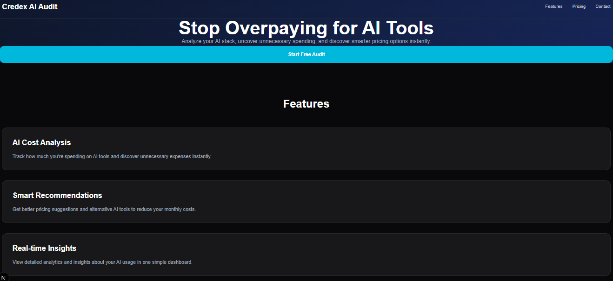
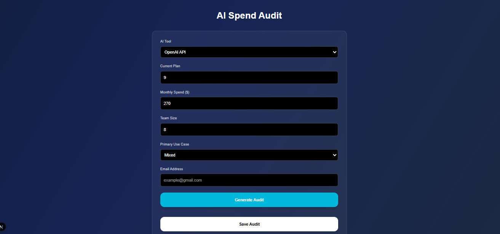

# Credex AI Spend Audit

AI spend optimization tool that audits AI tool subscriptions and suggests cheaper alternatives for teams and developers.

## Features

- AI tool spend calculator
- Savings recommendations
- Personalized audit summary
- Email capture
- Save audit button
- Shareable result link
- AI tool comparison
- Monthly and annual savings estimation

## Supported Tools

- ChatGPT
- Claude
- Gemini
- GitHub Copilot
- Cursor
- OpenAI API
- Anthropic API
- Windsurf
- v0
- Perplexity
- Midjourney
- Notion AI
- Canva AI

## Tech Stack

- Next.js
- TypeScript
- Tailwind CSS
- React

## Run Locally

```bash
npm install
npm run dev

## Live Demo
https://credex-ai-spend-audit-lime.vercel.app

## Screenshots




